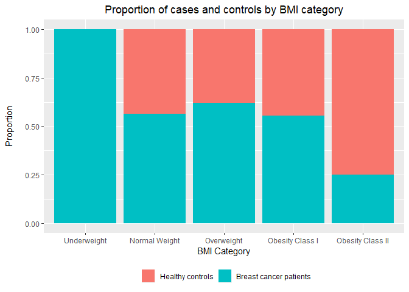

P8451 HW0
================
Will Simmons
1/17/2020

``` r
library(tidyverse)
```

    ## -- Attaching packages ---------------------------------------------------------------------------------------------- tidyverse 1.2.1 --

    ## v ggplot2 3.2.1     v purrr   0.3.3
    ## v tibble  2.1.3     v dplyr   0.8.3
    ## v tidyr   1.0.0     v stringr 1.4.0
    ## v readr   1.3.1     v forcats 0.4.0

    ## -- Conflicts ------------------------------------------------------------------------------------------------- tidyverse_conflicts() --
    ## x dplyr::filter() masks stats::filter()
    ## x dplyr::lag()    masks stats::lag()

``` r
library(readr)
```

0.  Importing data

<!-- end list -->

``` r
data = 
  read_csv('./data/dataR2.csv')
```

    ## Parsed with column specification:
    ## cols(
    ##   Age = col_double(),
    ##   BMI = col_double(),
    ##   Glucose = col_double(),
    ##   Insulin = col_double(),
    ##   HOMA = col_double(),
    ##   Leptin = col_double(),
    ##   Adiponectin = col_double(),
    ##   Resistin = col_double(),
    ##   MCP.1 = col_double(),
    ##   Classification = col_double()
    ## )

1.  Construct a table providing summaries of the quantitative features
    of the dataset. Summaries should include the mean, median, minimum
    value, and maximum value. If you are unable to construct a formatted
    table within R, you can print raw output, but then comment the
    output to identify the answer that was requested.

<!-- end list -->

``` r
data %>%
  summarize_all(
    list(
      Mean = mean,
      Median = median,
      Minimum = min,
      Maximum = max)
  ) %>% 
  gather(stat, val) %>% 
  separate(stat, into = c("Variable", "stat"), sep = "_") %>% 
  spread(stat, val) %>% 
  select(Variable, Mean, Median, Minimum, Maximum) %>% 
  knitr::kable(
    caption = "Summary of dataset variables"
  )
```

| Variable       |       Mean |     Median |    Minimum |    Maximum |
| :------------- | ---------: | ---------: | ---------: | ---------: |
| Adiponectin    |  10.180874 |   8.352692 |  1.6560200 |   38.04000 |
| Age            |  57.301724 |  56.000000 | 24.0000000 |   89.00000 |
| BMI            |  27.582111 |  27.662416 | 18.3700000 |   38.57876 |
| Classification |   1.551724 |   2.000000 |  1.0000000 |    2.00000 |
| Glucose        |  97.793103 |  92.000000 | 60.0000000 |  201.00000 |
| HOMA           |   2.694988 |   1.380939 |  0.4674087 |   25.05034 |
| Insulin        |  10.012086 |   5.924500 |  2.4320000 |   58.46000 |
| Leptin         |  26.615080 |  20.271000 |  4.3110000 |   90.28000 |
| MCP.1          | 534.647000 | 471.322500 | 45.8430000 | 1698.44000 |
| Resistin       |  14.725966 |  10.827740 |  3.2100000 |   82.10000 |

Summary of dataset variables

2.  Recode BMI into the WHO-defined categories below:

<!-- end list -->

  - Severely underweight - BMI less than 16.5kg/m^2
  - Underweight - BMI under 18.5 kg/m^2
  - Normal weight - BMI greater than or equal to 18.5 to 24.9 kg/m^2
  - Overweight – BMI greater than or equal to 25 to 29.9 kg/m^2
  - Obesity class I – BMI 30 to 34.9 kg/m^2
  - Obesity class II – BMI 35 to 39.9 kg/m^2
  - Obesity class III – BMI greater than or equal to 40 kg/m^2

<!-- end list -->

``` r
data =
  data %>% 
  mutate(
    BMI_new = 
      case_when(
        BMI < 16.5 ~ 'Severely Underweight',
        between(BMI, 16.5, 18.4) ~ 'Underweight',
        between(BMI, 18.5, 24.9) ~ 'Normal Weight',
        between(BMI, 25, 29.9) ~ 'Overweight',
        between(BMI, 30, 34.9) ~ 'Obesity Class I',
        between(BMI, 35, 39.9) ~ 'Obesity Class II',
        BMI >= 40 ~ 'Obesity Class III'
      )
  )
```

3.  Create a bar chart showing the proportion of breast cancer cases and
    controls within each BMI category

<!-- end list -->

``` r
data %>% 
  mutate(
    Classification = as.factor(Classification),
    BMI_new = fct_reorder(BMI_new, BMI)
  ) %>% 
  group_by(BMI_new, Classification) %>% 
  summarize(count = n()) %>% 
  mutate(percent = count/sum(count)) %>% 
  
  ggplot(
    aes(
      fill = Classification,
      x = BMI_new,
      y = percent
    )
  ) +
  geom_bar(
    position = 'stack', 
    stat = 'identity'
  ) +
  labs(
    y = 'Proportion\n',
    x = 'BMI Category',
    title = 'Proportion of cases and controls by BMI category'
  ) +
  theme(
    legend.position = 'bottom',
    plot.title = element_text(hjust = 0.5),
    legend.title = element_blank(),
    
  ) +
  scale_fill_discrete(
    labels = c('Healthy controls', 'Breast cancer patients')
  )
```

<!-- -->

4.  Construct a logistic regression model using breast cancer
    classification as the outcome and glucose, HOMA, leptin, BMI
    (continuous) and age as the independent variables.

<!-- end list -->

  - Fill in the beta estimate and 95% confidence interval associated
    with a 1-unit change in HOMA

<!-- end list -->

``` r
logistic_model =
  data %>% 
  mutate(
    Classification = as.factor(Classification),
    Classification = fct_recode(
      Classification,
      '0' = '1',
      '1' = '2'
    )
  ) %>% 
  glm(
    Classification ~ Glucose + HOMA + Leptin + BMI + Age,
    data = .,
    family = binomial
  ) 

logistic_model_tidy =
  logistic_model %>% 
  broom::tidy()

ci_betas =
  as.data.frame(
    confint.default(logistic_model)
  ) %>% 
  add_column(
    Variable = c(
      '(Intercept)',
      'Glucose',     
      'HOMA',  
      'Leptin',      
      'BMI',         
      'Age')
  )

final_table_logistic = 
  inner_join(
    logistic_model_tidy,
    ci_betas,
    by = c('term' = 'Variable')
  ) %>% 
  select(term, estimate, '2.5 %', '97.5 %', everything())

final_table_logistic %>% 
  knitr::kable()
```

| term        |    estimate |       2.5 % |    97.5 % | std.error |   statistic |   p.value |
| :---------- | ----------: | ----------: | --------: | --------: | ----------: | --------: |
| (Intercept) | \-3.6260648 | \-8.2421263 | 0.9899967 | 2.3551767 | \-1.5396148 | 0.1236543 |
| Glucose     |   0.0816987 |   0.0355895 | 0.1278079 | 0.0235255 |   3.4727682 | 0.0005151 |
| HOMA        |   0.2738822 | \-0.0631845 | 0.6109489 | 0.1719759 |   1.5925611 | 0.1112587 |
| Leptin      | \-0.0085738 | \-0.0395085 | 0.0223609 | 0.0157833 | \-0.5432196 | 0.5869786 |
| BMI         | \-0.1042605 | \-0.2152775 | 0.0067564 | 0.0566423 | \-1.8406817 | 0.0656682 |
| Age         | \-0.0228810 | \-0.0510592 | 0.0052973 | 0.0143769 | \-1.5915055 | 0.1114959 |

The beta estimate for a 1-unit change in HOMA is 0.2738822. The
associated 95% CI is (-0.0631845, 0.6109489).

5.  Construct a linear regression model using insulin as the outcome and
    BMI (continuous), age, and glucose as the independent variables.

<!-- end list -->

  - Fill in the beta estimate and 95% confidence interval associated
    with a 1-unit change in age.

<!-- end list -->

``` r
linear_model =
  data %>% 
  lm(
    Insulin ~ BMI + Age + Glucose,
    data = .
  ) 

linear_model_tidy =
  linear_model %>% 
  broom::tidy()

ci_betas_linear =
  as.data.frame(
    confint.default(linear_model)
  ) %>% 
  add_column(
    Variable = c(
      '(Intercept)',
      'BMI',     
      'Age',  
      'Glucose')
  )

final_table_linear = 
  inner_join(
    linear_model_tidy,
    ci_betas_linear,
    by = c('term' = 'Variable')
  ) %>% 
  select(term, estimate, '2.5 %', '97.5 %', everything())

final_table_linear %>% 
  knitr::kable()
```

| term        |     estimate |        2.5 % |      97.5 % | std.error |   statistic |   p.value |
| :---------- | -----------: | -----------: | ----------: | --------: | ----------: | --------: |
| (Intercept) | \-13.4957592 | \-24.9799980 | \-2.0115205 | 5.8594131 | \-2.3032612 | 0.0231101 |
| BMI         |    0.1496903 |  \-0.1713873 |   0.4707679 | 0.1638181 |   0.9137594 | 0.3628062 |
| Age         |  \-0.0540217 |  \-0.1558202 |   0.0477769 | 0.0519390 | \-1.0400988 | 0.3005341 |
| Glucose     |    0.2298179 |    0.1562895 |   0.3033463 | 0.0375152 |   6.1259998 | 0.0000000 |

The beta estimate for a 1-unit change in age is -0.0540217. The
associated 95% CI is (-0.1558202, 0.0477769).
